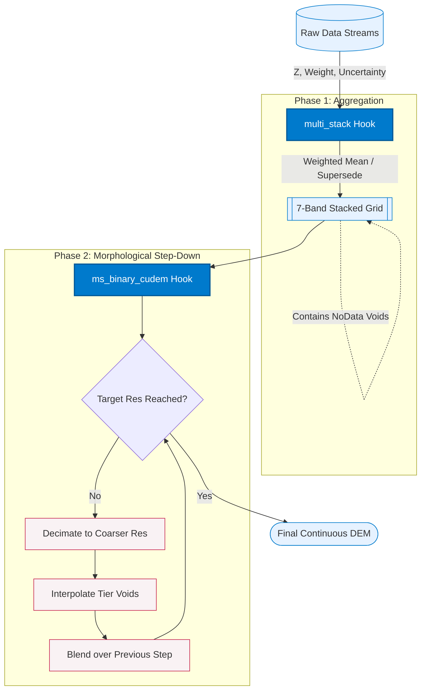

# 🌎 DEM Generation

**The Multi-Stack & Binary CUDEM Workflow**

A common question when configuring a `globato` pipeline is: *"What is the difference between `multi_stack` and `ms_binary_cudem`, and why do I need both?"*

**The Short Answer:**
*   **`multi_stack` is the Builder.** It compiles millions of raw, overlapping data points into a single, highly accurate base grid based on statistical weights. Because it only places data exactly where physical measurements exist, it leaves "NoData" voids where data is sparse.
*   **`ms_binary_cudem` is the Finisher.** It takes that base grid, mathematically zooms out to fill in the missing gaps using smart interpolation, and dynamically blends it all back together to create a seamless, continuous Digital Elevation Model (DEM).

You need both to create a statistically rigorous and visually continuous DEM.

---

## The Workflow Loop

The magic of `globato` happens because these two hooks form an interdependent loop. When `ms_binary_cudem` steps down to coarser resolutions, it actually calls `multi_stack` internally to re-bin the data, preserving all the statistical weights during the decimation process!

### Phase 1: multi_stack (The Aggregator)
The multi_stack hook operates at the front line of your data stream. It does not perform any interpolation or multi-resolution gridding. Instead, its job is accumulation and statistical binning.

* **How it works:** As data streams in, multi_stack drops points into pixels at your full target resolution. Data points falling into the same weight tier are combined using a weighted mean, while data in higher weight tiers completely supersede lower-weighted data.
* **Continuous Tracking:** It maintains a running .sums.tif file to track data continuously, preventing duplication and allowing immense datasets to be processed with minimal RAM overhead.
* **The Output:** It generates a 7-band statistical grid tracking the aggregated Z (elevation), Count (points per pixel), Weights, Uncertainty, Source Uncertainty, X, and Y.

### Phase 2: ms_binary_cudem (The Multi-Resolution Gap Filler)
The ms_binary_cudem hook is a Morphological Multi-Resolution Step-Down tool designed for smart interpolation. It bridges gaps in sparse datasets without destroying the high-frequency fidelity of your dense, high-resolution data (like coastal lidar).

* **How it works:** It takes the hole-filled multi_stack output and mathematically fills the voids. First, it decimates the data to the lowest specified resolution, where gaps shrink, making it easier to interpolate a base surface.

* **Iterative Step-Down:** It iterates step-by-step back up toward the full target resolution. At each step, it interpolates a new surface around the current tier's weight group.

* **The Output:** It smoothly cross-fades and supersedes the lower-res output with the higher-res data. It repeats this looping process until it reaches full resolution using your highest-weighted data, resulting in a seamless final DEM.

## Configuration & Parameters
When configuring ms_binary_cudem in your YAML recipes, you must define the number of steps (decimations) alongside arrays for weights, resolutions, algos, and blend_dists.

**Important Note on steps and Arrays (The Base Layer Rule):**
The steps parameter defines the number of times the tool will "zoom out" or decimate the data. Therefore, steps=3 results in 4 total tiers of resolution (1 Base Layer + 3 Decimation Steps).

**You do not need to provide exactly 4 values for every parameter!** globato is smart. If you provide an array that is shorter than your total tier count, it will automatically duplicate your last provided value to fill the remaining tiers.

* **Example:** If you set steps=3 and algos=["raster_fill", "interp_rbf"], globato automatically pads the list to ["raster_fill", "interp_rbf", "interp_rbf", "interp_rbf"].
